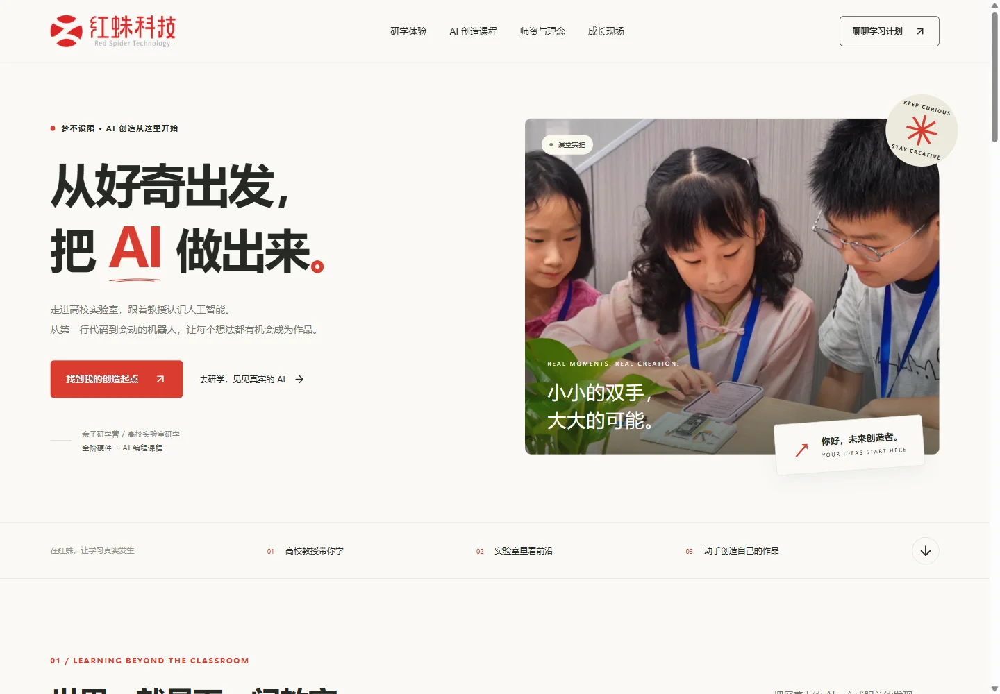
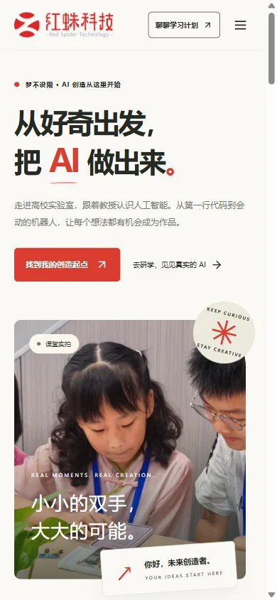

# 官网改版验收记录

> 本文件记录上一轮已部署版本。2026-09-24 09:18 已另行完成 SSL 续期，见 [SSL 更新记录](ssl-20260924.md)。本轮多页面改版的本地验证另见 [新版验证记录](redesign-20260924.md)。

验证日期：2026-09-24（北京时间）。以下为自动化检查与浏览器截图证据，尚未经用户人工验收。

## 线上版本

- 官网：<https://hzai.tech/>
- 发布编号：`20260924-147a675`
- 网站源码：`147a6757c3497711400a7d658df55f84387c8bbe`
- 公网版本读回：<https://hzai.tech/redspider-site/release.json>
- 后续提交仅补充检查脚本的异步等待、截图和本记录，不改变线上页面资产。
- 服务器：SSH 别名 `zgyjserver`；用户所写 `zgyj_servce` 未配置，已通过 SSH 配置与域名解析确认实际目标。
- 发布目录：`/opt/redspider-web/releases/20260924-147a675`
- 上传包 SHA-256：`429f0420a4b5536e5d9493ba8b41a8420808e687ab6f0558b9b3798a5f4c2af7`

## 需求核对

| 要求                                   | 当前证据                                                                                                       |
| -------------------------------------- | -------------------------------------------------------------------------------------------------------------- |
| 杭州红蛛科技有限公司官网，整站重新设计 | 新版品牌首页、暖白与红色视觉、桌面和手机布局；正式根路径返回 200                                               |
| 高校人工智能资深教授授课               | 师资与理念模块完整展示；未编造教授姓名及合作学校                                                               |
| 亲子研学营、高校实验室研学             | 两个独立实拍入口，可跳转咨询                                                                                   |
| 七个硬件与 AI 编程课程方向             | AI 语音玩具、桌面智能搭子、AI 开发、双轮足机器人、AI 智能汽车、机器狗、机械臂；均有原创 SVG 与可打开的详情     |
| 视频号“梦不设限AI训练营”               | 完整名称、复制按钮与微信搜索说明；浏览器验证剪贴板内容一致                                                     |
| 使用 pic 内实拍照片                    | 六张全部使用：小孩实践、小孩实践1、2、3、小孩玩机械狗、小孩走进大学；来源清单见 `public/redesign/sources.json` |
| 四个微信参考页面                       | 保留全部原文链接；正文读取受微信访问校验限制，未伪造文章标题或摘录                                             |
| 部署到 hzai.tech                       | 新官网与网关 Docker 镜像健康；公网 HTML、CSS、JS、图片等 20 个文件与发布产物 SHA-256 一致                      |

## 检查结果

- `npm ci`、`npm run typecheck`、`npm run lint` 通过。
- 默认根路径、GitHub Pages `/redspider-web/`、生产 `/redspider-site/` 构建成功。
- `scripts/smoke.mjs` 在本地三种路径和正式公网运行通过；本机使用已安装 Chrome，CI 使用 Playwright Chromium。
- 七门课程详情、三种分类筛选、Escape 关闭、咨询跳转、复制视频号、手机菜单和站内锚点通过。
- 320、390、768、1024、1440px 无横向溢出；图片全部加载，未记录页面异常、控制台错误或本站资源 4xx/5xx。
- 1440px 桌面与 390px 手机截图已逐图检查；手机首屏文字遮挡已修正。
- HTTP 根路径返回 301 到 HTTPS；原 API `/AiCampSignUp/api/health` 返回 200。
- 下列八个既有页面部署前后响应 SHA-256 全部一致：`AiCampHomePage`、`AiCampSignUp`、`ai_camp_car`、`ai_camp_3d_desktop`、`ai_camp_arm`、`ai_camp_robot_dog`、`ai_camp_miaoda`、`ai_camp_uni`。
- 原 API、web、PostgreSQL 容器未重新部署。新发布与上一个官网版本分开运行，保留回滚目标。
- GitHub PR 新增 `Website checks / verify`。最终远程 CI 状态以 PR 对应 HEAD 的 Checks 为准；本文件中的本地通过不代替远程 CI。

## 公网截图





完整长图：[桌面](desktop-full.webp) · [手机](mobile-full.webp)

## 回滚与边界

最新发布的备份位于 `/opt/redspider-web/backups/20260924-147a675/`。`teenai.env` 权限 600，包含原网关镜像配置；该文件不进入 Git 仓库。

回滚到前一个官网版本：

```bash
sudo bash /tmp/redspider-rollback.sh 20260924-147a675
```

恢复改版前的原首页重定向：

```bash
sudo bash /tmp/redspider-rollback.sh 20260924-fdbdd14
```

已验证备份与旧镜像存在、Nginx 配置有效；未为演练回滚而中断正式页面。未来部署 teenaiH5 网关时应保留官网路由。

**需要处理：现有 HTTPS 证书的 notAfter 为 2026-09-24 06:59:59 UTC，即北京时间 2026-09-24 14:59:59。** 当前浏览器与 HTTPS 校验有效，但服务器未发现 certbot 或 acme.sh 续期配置。本次未申请或替换证书，需在到期前更新原网关挂载的证书。

咨询二维码沿用原项目“官方客服.png”；已验证图片展示与打开功能，未声称完成微信端扫码联系或报名支付 UAT。课程年龄、课时、费用、开班日期与详细师资信息未获提供，页面不虚构这些内容。
